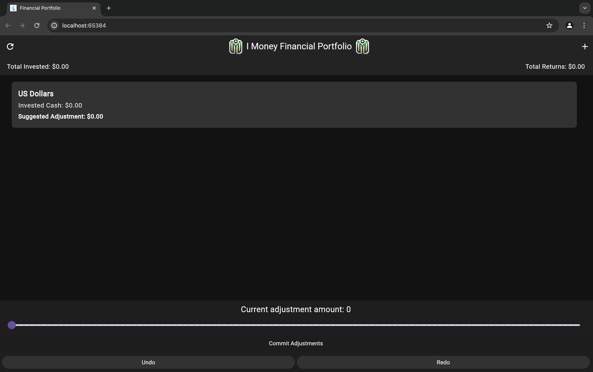

# financial portfolio rebalancer

## Description
Our financial portfolio rebalancer application lets a user track specific stocks, using realtime stock market data, and adjust their investments based on personal risk tolerance. This application makes predictions on which stocks to sell and buy in order to maximize profits for the user. This is done by incorporating an EMA (Exponential Moving Average), which is a formula that tracks the trends of a particular stock price. The features include the ability to choose which stocks you want to add to your portfolio, select how much you want to buy per investment, and change your risk tolerance on an adjustable bar in the UI.  

## Data design and Data flow 
Our provider was a single source of truth for our Hive secure storage and undo/redo functionality, along with the state of our portfolio in general, which itself has nested inside of it a list of portfolio entries and stocks associated with them. 

While implementing the functionality of everything was non-trivial, the data structures themselves were straightforward. Stocks contained lists of time series prices. Portfolio entries contained lists of transactions. Portfolios themselves were lists of portfolio entries. Two stacks were also used to manage undo/redo functionality.


## Visuals 
Home Screen of Application  
  

Adding Stock to the Portfolio  


## Installation
In order to install the applicaiton, do the following: 
- Clone our repo from Gitlab
- run `flutter pub get` then `flutter run`

## Usage
The user picks two stocks to add to their portfolio, choosing an amount to buy for each. They then adjust their risk tolerance which shows them how to move their investments in order to maximize profits. Once they find a tolerance that they like on the adjustable scale, they commit their changes with the Commit button in the UI.

## Support
There will be no support for this project after May 30.

## Roadmap
1. code out provider, portfolio, portfolio entry, and stock classes
2. code out main view, add view, and edit view
3. clean up UI and meet the rubric requirements
4. implement hive
5. implement undo
6. make sure everything works and documentation

## Contributing
run `flutter pub get` then `flutter run` to start playing around with it. Make sure you have flutter installed first.

Comment in the following manner:
```dart
/// Calculates the sum of two integers.
/// Parameters:
///  - a: First integer.
///  - b: Second integer.
/// Returns: The sum of a and b.
int add(int a, int b) {
 // Implementation, Invariants, etc...
}
```

Our development team is open to outside contributions.  The following steps will help you properly run our code:
- Clone our repo from Gitlab
- run `flutter pub get` then `flutter run`

## Authors and acknowledgment
Show your appreciation to those who have contributed to the project.
Development Team Members: 
- Joey Krueger
- Paul Lam
- Brandon Leong
- Joey Pirich
- Kevin Mason

## License
For open source projects, say how it is licensed.
We are using the MIT License for open source work.

## Project status
We are not intending to work on this project in it's current state, however several authors are interested in continuing with a utilizable version of this project.
