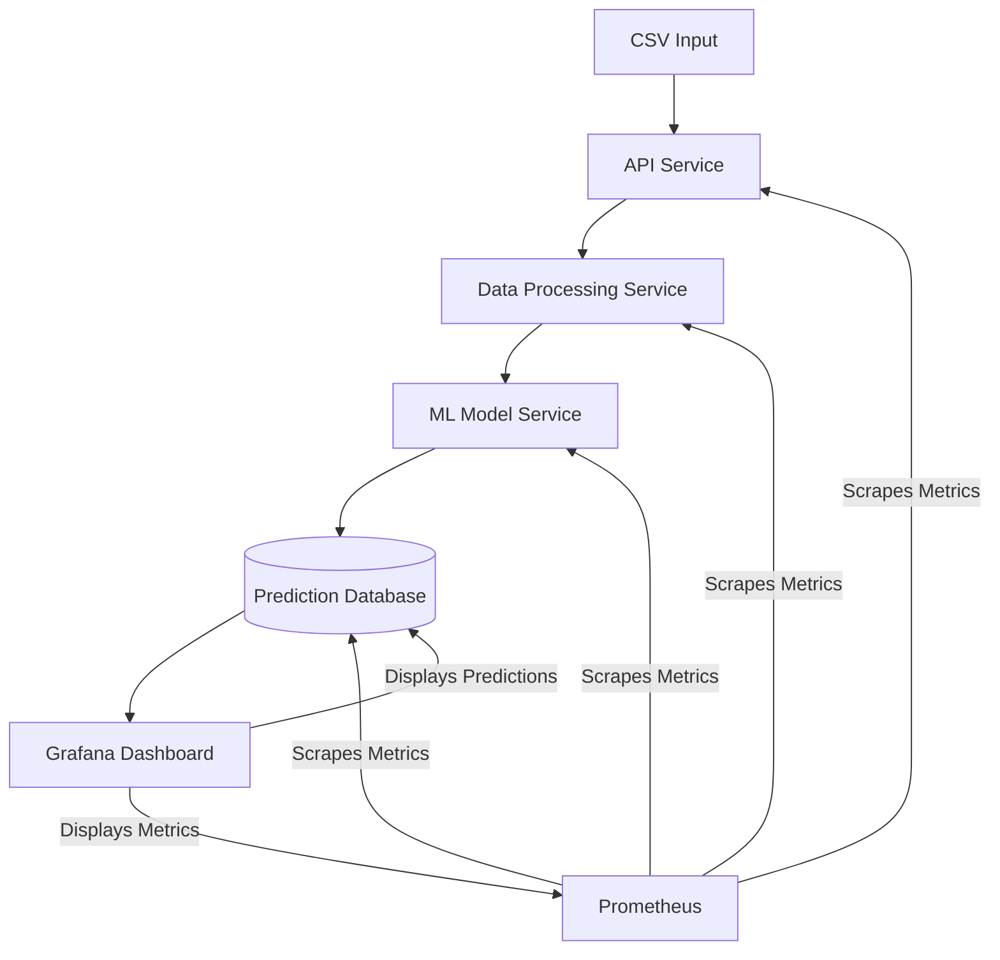

# Stock Price Prediction System
A simple, Kubernetes-based application for predicting stock prices 10 days into the future using regressive ML time-series models.
## Architecture
The system consists of the following components:

1. **API Service** - Handles user requests and orchestrates data flow
2. **Data Processing Service** - Validates, cleans, and prepares CSV data
3. **ML Service** - Trains models and makes predictions
4. **Prometheus** - Collects metrics from all services
5. **Grafana** - Displays dashboards with metrics and application status

All components are containerized and deployed on Kubernetes for scalability and reliability.
## Data Format
The system expects CSV files with the following format:
Copyticker,sector,date,close,open,low,high,volume
AAPL,Technology,2023-01-01,180.45,178.89,178.55,182.10,32567800
AAPL,Technology,2023-01-02,182.65,181.50,180.70,183.25,35678900
...
The file should contain approximately 100 days of stock data for each ticker to make accurate predictions.
## Machine Learning Models
The system uses two types of regression models:

**Linear Regression** - A simple baseline model
**Random Forest Regression** - A more complex ensemble model

Features used for prediction include:

- Price changes (returns)
- Volume changes
- High-to-low price ratios
- Close-to-open price ratios
- Lagged features (1-5 days)

The models predict the stock price 10 days into the future.
## Deployment
### Prerequisites

Kubernetes cluster (can be local like Minikube or a cloud provider)
kubectl configured to connect to your cluster
Basic understanding of Kubernetes concepts

### Deployment Steps

Clone this repository:
```bash
git clone https://github.com/yourusername/stock-predictor.git
cd stock-predictor
```

Create Kubernetes manifests from the provided artifacts:
```bash
# Create the kubernetes-manifests.yaml file
# Create the configmap-manifests.yaml file
# Create the monitoring-configs.yaml file
```

Apply the manifests to your Kubernetes cluster:
```bash
kubectl apply -f kubernetes-manifests.yaml
kubectl apply -f configmap-manifests.yaml
kubectl apply -f monitoring-configs.yaml
```

Wait for all pods to be running:
```bash
kubectl get pods -n stock-predictor
```

Access the application:
```bash
# If using Minikube
minikube service -n stock-predictor api-service

# If using a cloud provider, get the external IP
kubectl get svc -n stock-predictor api-service
```

Access Grafana dashboards:
```bash
# If using Minikube
minikube service -n stock-predictor grafana

# If using a cloud provider, get the external IP
kubectl get svc -n stock-predictor grafana
```

Default Grafana credentials:
- Username: admin
- Password: admin (change this in production)

## Usage
### Uploading Stock Data
To upload stock data, use the API service:
```bash
curl -X POST -F "file=@your_stock_data.csv" http://<api-service-url>/upload
```
### Getting Available Tickers
To get a list of available tickers from the uploaded data:
```bash
curl http://<api-service-url>/tickers
```
### Training Models for a Specific Ticker
To train models for a specific ticker:
```bash
curl http://<api-service-url>/train/AAPL
```
### Making Predictions
To get a prediction for a specific ticker:
```bash
curl http://<api-service-url>/predict/AAPL
```
### Batch Predictions
To make predictions for multiple tickers at once:
```bash
curl -X POST -H "Content-Type: application/json" -d '{"tickers": ["AAPL", "MSFT", "GOOGL"]}' http://<api-service-url>/batch-predict
```
### Monitoring
The system provides comprehensive monitoring via Prometheus and Grafana:

- **API Service Metrics** - Request rates, response times, error counts
- **ML Service Metrics** - Model accuracy, prediction times, training requests
- **Data Processing Metrics** - Processing times, records processed

Access the Grafana dashboard at `http://<grafana-url>` and log in with the credentials mentioned above.
## Customization
### Adding New Models
To add new ML models, modify the `ml-service-code` ConfigMap in the `configmap-manifests.yaml` file:

Import your desired model from scikit-learn or another library
Add it to the `models_to_train` dictionary in the `train_models` function
Update the `predict` function to use the new model

## Scaling the System
To handle more requests, you can scale the API service:
`kubectl scale deployment api-service -n stock-predictor --replicas=5`
For processing larger datasets, increase the resource limits in the Deployment specs.

## Limitations and Future Improvements
- Currently, the system only supports CSV file input. Future versions could add API integrations with financial data providers.
- The models are simple regressive models. More sophisticated models like LSTM, ARIMA, or Prophet could be implemented.
- Add user authentication and multi-tenancy support.
- Implement model versioning and A/B testing.
- Add automated retraining on a schedule.

# Roadmap for Barebones Stock Price Speculation Platform
## Phase 1: Set Up the Kubernetes Environment
- [ ] Set Up a Kubernetes Cluster:
- [ ] Use a local cluster for development (e.g., Minikube, Kind, or K3s).
- [ ] Alternatively, use a managed Kubernetes service (e.g., GKE, EKS, AKS) for production.
- [ ] Install Required Tools:
  - Install kubectl and helm for managing Kubernetes resources.
  - Set up a container registry (e.g., Docker Hub, GitHub Container Registry) for storing Docker images.
- [ ] Deploy a Monitoring Stack:
  - Install Prometheus and Grafana using Helm for monitoring resource usage.
  - Example:
    - `helm install prometheus prometheus-community/prometheus`
    - `helm install grafana grafana/grafana`
## Phase 2: Data Ingestion
- [x] Fetch Stock Price Data: Use a stock market API (e.g., Alpha Vantage, Yahoo Finance) to fetch historical and real-time data.
- [x] Write a Python script to fetch data and save it to a file (e.g., CSV).
- [ ] Containerize the Data Ingestion Script:
  - Create a Docker image for the data ingestion script.
- [ ] Deploy as a Kubernetes CronJob: Create a CronJob to run the data ingestion script periodically (e.g., every hour).

## Phase 3: Data Preprocessing
- [x] Preprocess Data: Write a Python script to clean and preprocess the stock price data (e.g., handle missing values, normalize data).
- [ ] Save the preprocessed data to a shared storage (e.g., NFS, S3, or Kubernetes Persistent Volume).
- [ ] Containerize the Preprocessing Script:
- [ ] Create a Docker image for the preprocessing script.
- [ ] Deploy as a Kubernetes Job: Create a Job to run the preprocessing script after data ingestion.

## Phase 4: Model Training
- [ ] Train a Simple Model: Write a Python script to train a simple model (e.g., LSTM for time series prediction).
- [ ] Save the trained model to shared storage.
- [ ] Containerize the Training Script: Create a Docker image for the training script.
- [ ] Deploy as a Kubernetes Job:
- [ ] Create a Job to run the training script after data preprocessing.

## Phase 5: Model Deployment
- [ ] Serve the Model as a REST API:
- [ ] Write a Python script using Flask or FastAPI to serve the trained model as a REST API.
- [ ] Containerize the API: Create a Docker image for the API.
- [ ] Deploy as a Kubernetes Deployment: Create a Deployment to serve the API.
- [ ] Expose the API:
- [ ] Create a Service to expose the API.
- [ ] Example Service YAML:

## Phase 6: Monitoring
- [ ] Monitor Resource Usage: Use Prometheus and Grafana to monitor CPU, memory, and API performance.
- [ ] Set Up Alerts: Configure alerts for high resource usage or failed jobs.

## Phase 7: Testing and Iteration
- [ ] Test the Platform: Run end-to-end tests to ensure data ingestion, preprocessing, training, and deployment work as expected.